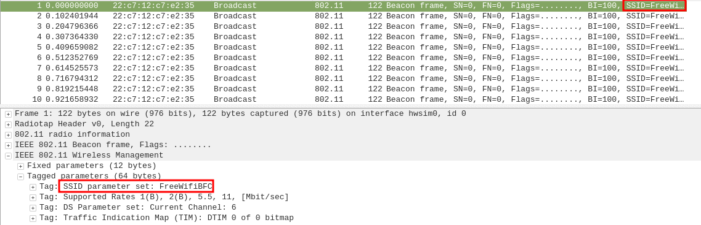
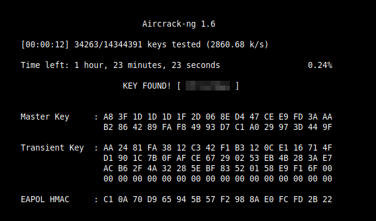
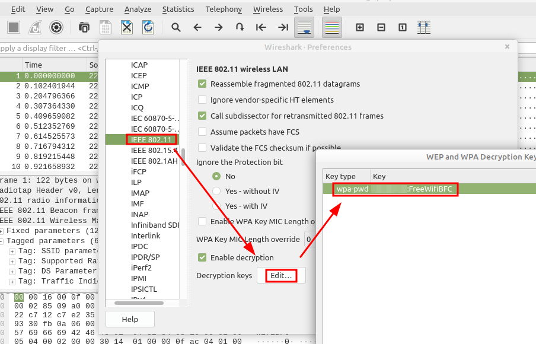
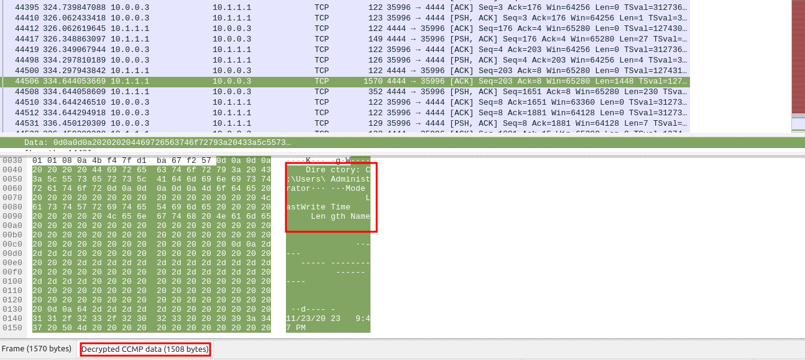
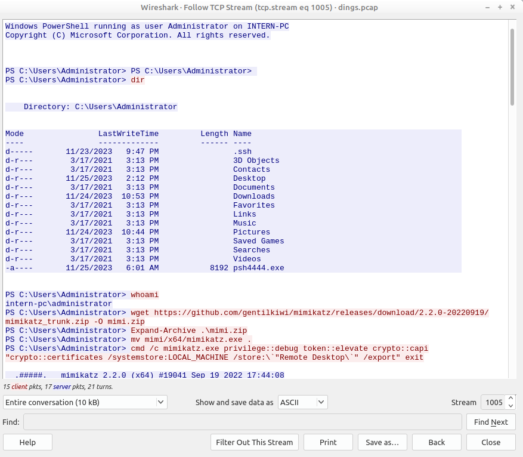
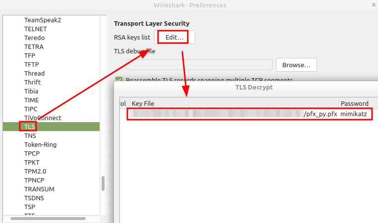
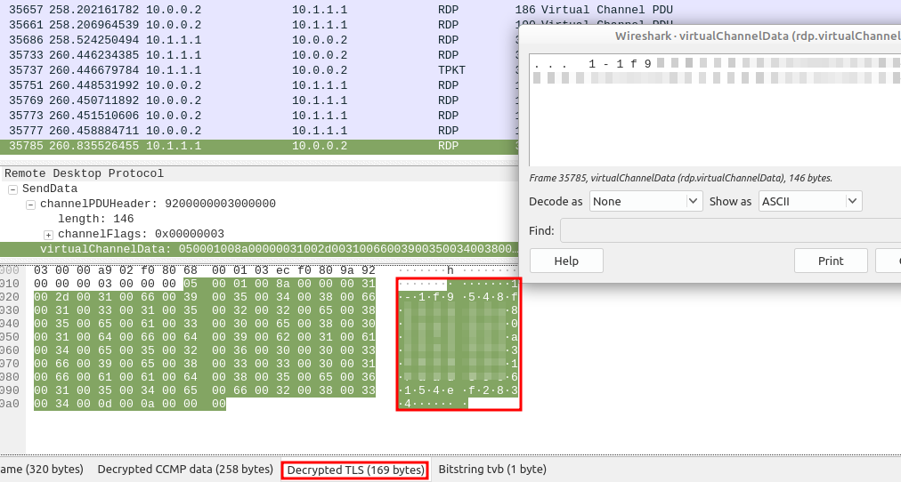

# AoC23 Sidequest 1: The Return of the Yeti
You can find the challenge here: <https://tryhackme.com/room/adv3nt0fdbopsjcap>.
You could find the four pieces of a QR code to this challenge on TryHackMe's social media. 

## IEEE 802.11 Decryption

When looking at the provided pcap using wireshark, we only see CCMP encrypted IEEE 802.11 packets. So, we want to find the wifi name and password to decrypt these, and to answer the first two questions.


to get the name, we just take a look at the ssid:



For the password, we can use [aircrack-ng](https://nooblinux.com/crack-wpa-wpa2-wifi-passwords-using-aircrack-ng-kali-linux/) and the wordlist [rockyou.txt](https://www.keepersecurity.com/blog/2023/08/04/understanding-rockyou-txt-a-tool-for-security-and-a-weapon-for-hackers/). Since aircrack-ng doesn't seem to support pcapng, we first save it as pcap using wireshark. Then we run:

```bash
aircrack-ng PACKET_FILE_NAME.pcap -w PATH_TO_ROCKYOU.txt
```



Next, we use the wifi name and password we found, to decrypt the packets in wireshark. To do so, go to Edit > Preferences > Protocols > IEEE 802.11 in wireshark, and Edit Decryption keys



After clicking on 'OK', you now should be able to see tcp,tls and other packets in wireshark. Next, we'll find a pfx file to decrypt the TLS packets.


## TLS Decryption

When we filter for `tcp` and scroll all the way down, we see some suspicios traffic that is marked red. Seems as if something was brute-forced. After some more scrolling, the red traffic stops, so the attacker either failed and gave up, or got in. As we see when inspecting the tcp traffic that follows, he got in.



When following the tcp stream by right-clicking a packet of it, clicking on Follow and then on TCP Stream, we can see the full thing:



The attacker used [mimikatz](https://github.com/gentilkiwi/mimikatz/tree/master) to get the pfx file. He then decoded it using the powershell command
```powershell
[Convert]::ToBase64String([IO.File]::ReadAllBytes("/users/administrator/LOCAL_MACHINE_Remote Desktop_0_INTERN-PC.pfx"))
```

So, if we convert the output of that command back, we should get the pfx file. If you're on windows, you can just use following powershell commands:

```powershell
$b64      = Get-Content "C:\path\to\base64\string\file"
$filename = 'C:\path\to\Rresulting\pfx'

$bytes = [Convert]::FromBase64String($b64)
[IO.File]::WriteAllBytes($filename, $bytes)
```

if you're on linux, you have to consider that Windows users UTF-16LE while Linux uses UTF-8. So, for decoding the base64, you need to interpret it as UTF-16LE. Here's a little python script that does the trick:

```python
# load base64 string from file into variable
with open('base64str','r') as f:
    base64str = f.read()


import base64

# encode base64str as utf-16le, because that's what windows powershell uses
base64_bytes = base64str.encode("utf-16le")

# decode base64 bytes
pfx_bytes = base64.b64decode(base64_bytes)

# write decoded pfx to file
with open('pfx_py.pfx','wb') as f:
	f.write(pfx_bytes)
```

Either way, you should get a working pfx file as a result. To decrypt the TLS traffic in wireshark with it, go to Edit > Preferences > Protocols > TLS and edit the RSA Key list. choose your pfx file and use the password `mimikatz`, since it was created using mimikatz.



Next, we have to analyse the traffic we just decrypted, to find the last two flags.

## Finding the last flags

Let's filter for `tls`, because that's what we just decrypted. We see [RDP (Remote Desktop Protocol)](https://en.wikipedia.org/wiki/Remote_Desktop_Protocol) Traffic. We also see lot's of nearly identical frames that all have length 200. We can filter them out using `frame.len != 200`. Also, we are only interessted in the RDP stuff, so let's add `rdp` to our filter. The resulting filter is:
```
tls && frame.len != 200 && rdp
```

(alternatively, you can also just filter for `rdp_cliprdr`, because what we're searching for is the clipboard content. But the version i'm using right now doesn't support that). If you now take a look at the decrypted TLS data of some of these files, you will see interesting stuff. A weird number (the case number) and something that looks like a yetikey!


