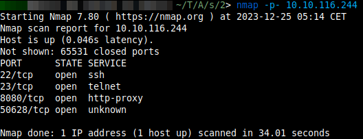
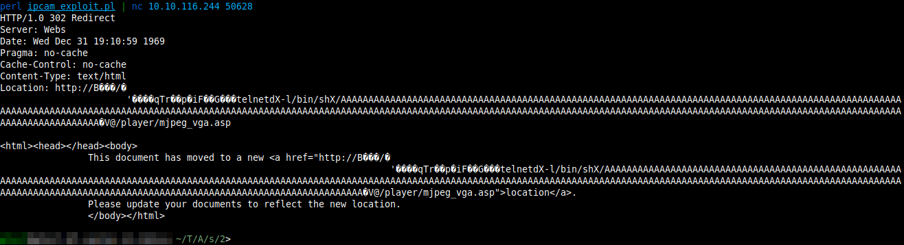
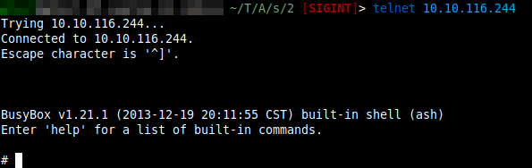
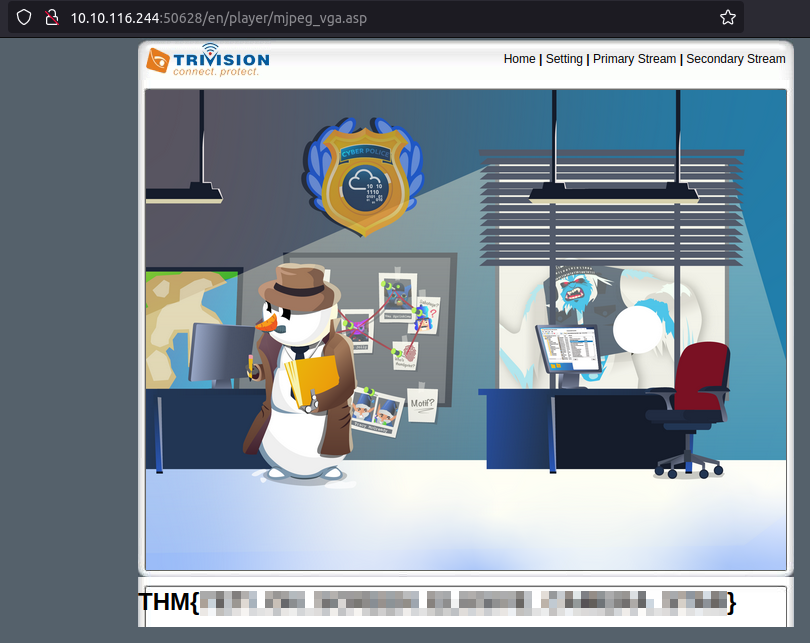
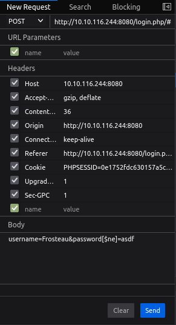
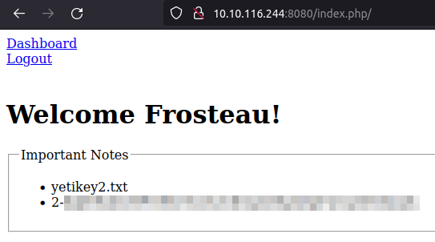

# AoC23 Sidequest 2: Snowy ARMageddon
You can find the challenge here: <https://tryhackme.com/room/armageddon2r>.
You could find a QR code to this challenge on [AoC23](https://tryhackme.com/room/adventofcyber2023) day 6.

<strong>WARNING:</strong> **The solution shown here, seems to have been unintended. It might not be working anymore.**

## Part 0: NMAP Scan

The Yeti told us to be stealthy, so let's keep the scan simple:
```bash
nmap -p- IP_ADDRESS
```



Port 50628 and Port 8080 are open. Port 50628 closes if we aren't sneaky enough, let's check that one out first.

## Part 1: Port 50628

When opening IP_ADDRESS:50628 in a browser, we see it's an interface for an IP cam. When googling that cam up, we see it might be vulnerable to a bufferoverflow. I found an interesting perl script called [ipcam_exploit.pl](ipcam_exploit.pl) in this video: <https://youtu.be/NVl6uJiEaoI?feature=shared&t=2751>. Let's use it as shown in the video:

```bash
perl ipcam_exploit.pl | nc IP_ADDRESS 50628
```
Telnet should now have a shell open on the cam. let's try connecting to it:
```bash
telnet IP_ADDRESS
```

We get our first shell!


After a bit of searching, we find the cams username and password in `/etc/webs/umconfig.txt`. After using these to log into the cams website, we get our first flag!



The yetikey will probably be on port 8080, so let's take a look at that.

## Part 2: Port 8080

After some enumeration of this page (for example using dirb), we find the page `IP_ADDRESS:8080/login.php/`.
From the image we found on the IP cam, and the text on the challenges TryHackMe page, we know that detective Frosteau is working on the case. So let's use `Frosteau` as username. We don't know a password for this, and brute-forcing is no help. So, let's try [SQLi](https://en.wikipedia.org/wiki/SQL_injection). The usual stuff like `' OR 1=1` isn't doing anything. Maybe the database behind this is not a usual SQL database, but a [NoSQL](https://en.wikipedia.org/wiki/NoSQL) database. Let's try some [NoSQL Injection](https://book.hacktricks.xyz/pentesting-web/nosql-injection). instead of sending `username=Frosteau&password=asdf` we send
```
username=Frosteau&password[$ne]=asdf
```

We can do this using burp or Firefox. I did it in Firefox:



After sending this, we just need to go to /index.php/ (don't forget the last slash!) to get the yetikey


