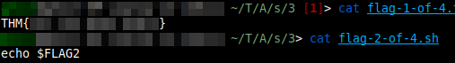

# AoC23 Sidequest 3: Frosteau Busy with Vim
You can find the challenge here: <https://tryhackme.com/room/busyvimfrosteau>.
You could find a QR code to this challenge on [AoC23](https://tryhackme.com/room/adventofcyber2023) day 11.

## Part 0: NMAP Scan

First, let's do an nmap scan:
```bash
nmap -T4 -A -p- IP_ADDRESS
```


We find the usual ssh port; that's probably not interessting. Port 80 has some http running, but it doesn't allow any methods. The interesting ports are:
- Port 8065: We can reach this with telnet, but we are yet to know what its purpose is
- Port 8075: An FTP port
- Port 8085: When connecting to this via telnet, Vim opens
- Port 8095: Connecting via telnet opens Nano

## Part 1: FTP
Let's take a look at ftp:
```bash
ftp IP_ADDRESS 8075
```
We can log in as anonymous. When listing files, we already see some interessting files; let's download them using `get filename`:


(in case you get a connection timeout, check your firewall)



The first file contains our first flag! The second only contains the string `echo $FLAG2`, so the second flag seems to be stored in a variable called FLAG2 on the machine. We'll get to that Soon. 

But first, let's upload a bash shell to the machine:
```bash
put /bin/bash sh
```
You'll see what we need this for in the next section: Vim

## Part 2: VIM
We exit ftp and jump into port 8085 using telnet:

```bash
telnet IP_ADDRESS 8085
```
Vim opens. You were warned by this sections title, so don't blame me if you can't escape this Vim window ever again now. Before we begin, let's review some basic Vim commands that'll help us:

- `E`: shows directory listing and lets you navigate it
- `e [file]`: opens file
- `w [file]`: writes currently opened content into file
- `echo 'whatever'`: same as usual echo command
- `!bash_command`: runs bash command (at least if you have a shell)
- `q`: lets you quit vim

You can use these, by typing `:` followed by the command.

As you see, we have an echo command. Let's use it to get the second flag:


Next, we want to have a shell. when trying to run `!echo 'asdfa'` or any other bash command, we see an error saying `Cannot execute shell /tmp/sh`. When navigating to `/tmp` and listing the files using `E`, we see that we don't see any `sh` file. When taking a look into `/usr/bin` trying to find a shell, we see that there is nothing at all. But there's an empty executable file called `sh` in `/usr/frosty`.

As you may remember, we previously used ftp to put a shell into /tmp/ftp via ftp. But when trying to use that, we see that it doesn't work. The executable bit isn't set.

So, we have an empty executable called `/usr/frosty/sh`, and a non-executable shell called `/tmp/ftp/sh`. Let's just combine these two, by writing the content of `/tmp/ftp/sh` into `/usr/frosty/sh`:
```
e /tmp/ftp/sh
w! /usr/frosty/sh
```


Now we have an executable shell with the right content. Let's tell Vim to use it:
```
set shell=/usr/frosty/sh
```
We can now spawn a shell in Vim by using:
```
!/usr/frosty/sh
```


But this shell doesn't seem to be much help. The [GNU Core Utilities](https://www.gnu.org/software/coreutils/) (stuff like `ls`, `cat`, etc) are missing, and we don't have any more rights than before. We still can't access the `/root` directory.

The abscense of `ls` and `cat` is not a big problem, we can just use stuff like:
```bash
echo *  # really basic ls command
echo $(<file.txt)   # really basic cat command
```
And we can Navigate using `cd`. But we could already do stuff like this in Vim.

## Part 3: Busybox
While banging our heads against the screen, we remember that vim and ftp weren't the only ports we saw in our nmap scan. There also was port 8065 which didn't seem to do anything before. Let's try that port again:

```bash
telnet IP_ADDRESS 8065
```

We get a shell. This port is running `/usr/frosty/sh`. And it's not just a Standart shell; we can now use `cd /root` without getting permission denied.

Using our previously introduced basic ls command, we see a file called `flag-3-of-4.txt`. Using `echo $(<flag-3-of-4.txt)` we see its content.


Now that we have the third flag, let's finally get some GNU Core Utilities. When navigating the directory using Vim or the shell, we stumble upon an executable called `/etc/file/busybox`. We google it up and see: this thing let's us use cool commands like `ls` and `cat`! let's give it an alias in our shell:
```bash
alias box=/etc/file/busybox
```
Now we can just use `box some_command` to execute commands like `ls`, `cat`, `chmod`, etc. But we're still missing the fourth flag. Where could it be? When looking around the file system, it seems as if we are in a docker container. Let's escape!

## Part 4: Docker
When searching for 'escape docker container' we find pages like <https://book.hacktricks.xyz/linux-hardening/privilege-escalation/docker-security/docker-breakout-privilege-escalation> that tell us, we may be able to use `fdisk -l` to see the host drive. And it works! let's mount it:
```bash
box mkdir -p /mnt/hola
box mount /dev/[name of host drive] /mnt/hola
```
now we can just `cd` into `/mnt/hola/root` and get the last flag!


