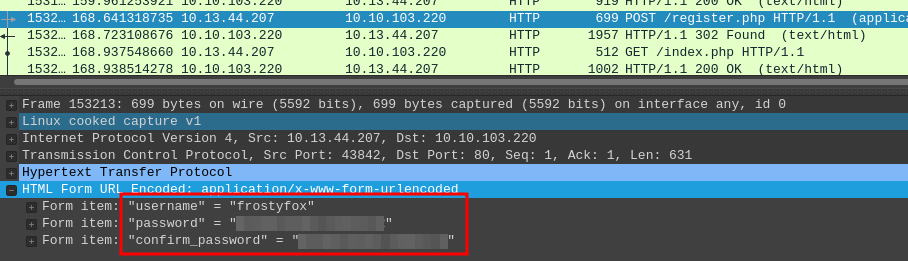
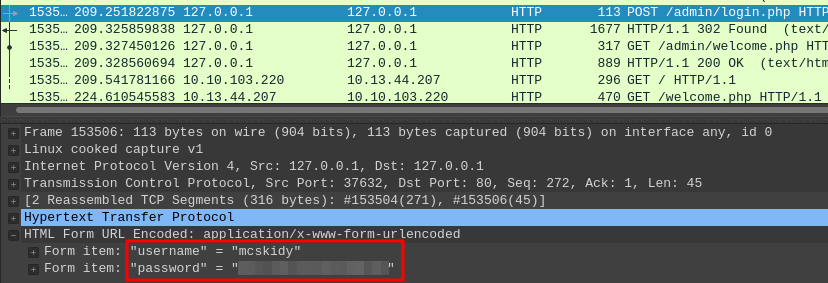
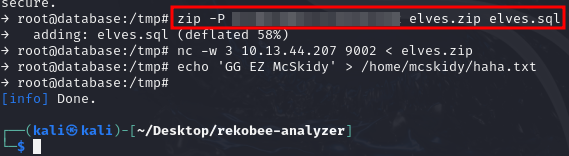
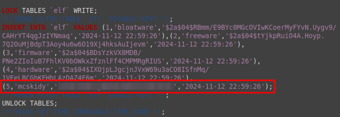

# T1: Operation Tiny Frostbite

https://tryhackme.com/r/room/adventofcyber24sidequest

## Q1
The Zip file contains a pcap file. If we open it in Wireshark, and scroll through the packets, we find some HTTP packets. If we apply the filter `http`, we see that the attacker was searching subdomains, and found `/admin/login.php`. We also see a POST request to `/register.php`. If we take a look at the "HTML Form URL Encoded" part of that packet, we see the username frostyfox, and the password the attacker used.



## Q2
Further down the list of HTTP requests, we also see a POST request to `/admin/login.php` it gives us mcskidy's password.



## Q3
This is the Question that probably took everyone the longest.

To solve it, let's first take a look at the remaining HTTP requests. There are some more requests to `/admin` subpages, but they don't seem too interesting. What's more interesting, is the GET requests, that go from the server to the attacker. so, let's filter for `http.request.method == "GET" && ip.dst == 10.13.44.207`. If we right-click on the GET request to `/exp_file_credentials`, and click on Follow > TCP Stream, we see that the victim was downloading an [ELF file](https://en.wikipedia.org/wiki/Executable_and_Linkable_Format) from the attacker. the GET request to `/ff` is also downloading an ELF file. If we click on `File > Export Objects > HTTP`, we see a list of objects that were transmitted over HTTP. If we set the `Content Type` to `application/octet-stream`, only the two ELF files are shown. let's save both of them so we can take a look.

If we upload `exp_file_credential` to virus total, we see that it exploits [CVE-2022-2588](https://nvd.nist.gov/vuln/detail/CVE-2022-2588). This is probably the initial exploit that allows the attacker to access the victim's system. For the ff file, virus total even gives us a name: "Rekobee" (some results on virus total are also calling it "Rekoobe", but if we type "Rekobee" into google, we get more interesting results). If we google that name, we find a tool called [rekobee-analyzer](https://github.com/alexander-utkov/rekobee-analyzer). It's a tool that decrypts Wireshark traffic that was sent and received using the ff binary. So, we just need to find that encrypted traffic and this tool will tell us, what the attacker did.

If we take a look at the "Behavior" Tab of ff in Virus total, and scroll down to "IP Traffic", we see that it uses port 9001 for communication. so, let's filter for that port in Wireshark: `tcp.port == 9001`. Below four \[Syn\], \[RST,ACK\] packets, we see lot's of weird TCP encrypted packets; exactly what we were looking for! if we right-click on one of them and `Follow > TCP Stream`, we see the full encrypted conversation. Let's mark all of those packets using `Ctrl + a`, and export them into a seperate pcap file using `File > Export Specified Packets`. We can now use the rekobee analyzer to see the communication (Installing and running instructions are on the Github page). The only thing we still need, is the password that encrypts the communication. We can either use the method described on the github to find the password, or we can use the strings command `strings ff.elf` and scroll until we find the very secret looking string: `SuP3RSeCrEt`. So, let's run the rekobee analyzer:

```bash
python analyze.py -c ../bccc.pcapng -s SuP3RSeCrEt
```

We see, that the attacker logged into a mysql database, dumped the database, zipped it, and sent it back to his machine. We also see the password that was used for the zip file.



## Q4

After this, the last question is pretty straight forward.

In the original pcap file, we can just filter for the magic number of zip files to find the zip:

```
tcp contains 50:4b:03:04
```

it yields a single TCP packet. If we right-click it's Data section, and click on `Show Packet Bytes`, we see the full zip. We can then select `Show as Raw` and click `Save as...` to save it as a zip, and extract that zip file using the password found in Q3. We can then take a look at the database (for example by just putting it in a text editor), and find McSkidy's password inside it.


