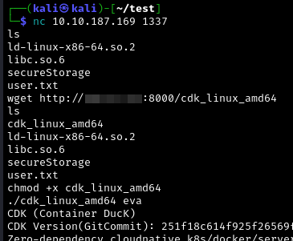

# T3: Escaping the Blizzard

https://tryhackme.com/r/room/adventofcyber24sidequest

## Q1: Getting a foothold

After booting up the machine, and unlocking it using the keycard (go to http://MACHINE_IP:21337/ and put it in), we run a quick nmap scan, that shows a webserver running on port 80. A quick directory brute force with dirb or whatever tool one prefers shows the subdirectory /backup, where we find some interesting files that we download. A password encrypted .zip file, a password list, and a file called "enc". Using the `file`command, we see it's an x86-64 ELF file. `chmod +x enc` makes it executable. To crack the zip file, we first run:

```bash=
zip2john secure-storage.zip > hash.txt
```

If we try to decrypt it using john the ripper and the `recommended-passwords.txt` file, we don't find the password. So, instead of using the password list as it is, we write and run a little python script (`encrypt.py`) to encrypt all the passwords in it using `./enc`.

We then run:

```bash
john hash.txt --wordlist=encrypted_passwords.txt
```

to get the password for the zip.


Inside the zip, there's the `foothold.txt` and some other interesting files...

## Q2: Insane Heap Exploitation

*_TL;DR for experts_: House of Orange to leak libc, House of Tangerine to get arbitrary read/write, find stack pointer in libc, write ROP chain to stack by using House of Tangerine again.*

*_TL;DR for people who just want the flag_: Change the IP address in expl.py, put it in a folder with `libc.so.6` and run it. If it doesn't work the first time, just run it a second time, maybe it just had a network issue.*

I tried to explain this part in detail, so people without much heap exploitation experience will hopefully be able to understand it.

This flag was a _little_ bit harder to get than the other ones. In the zip file, we have a dockerfile, a dynamic linker, a version of libc and an ELF file called `secureStorage`. When running `strings libc.so.6 |grep version`, we see the version is 2.39. When running `secureStorage` and looking at it in IDA (or ghidra or any other decompiler) we see it's a simple text based application that lets us create (`malloc()`), edit and read "Permit Entries" on the heap. Sadly it doesn't let us delete (`free()`) those entries, but we'll get to that later...

In IDA we see, that the create and edit functions let us write 0x10 more bytes then it allocated:


This means, we have a heap overflow. But what even is the heap? And what can we do with an overflow? To anyone who wants to get a deeper understanding, i recommend the lectures and challenges on https://pwn.college/software-exploitation/dynamic-allocator-misuse. I'll briefly explain the basics.

### What is the Heap? 

The Heap is basically just a place in a programs memory where data can be stored at runtime. But it's different to the Stack in many ways. It's a completely different memory region and a heap overflow lets us do different things than a stack overflow. 

To store data on the Heap, the program first needs to allocate a chunk on the heap using `malloc(size)` or a similar function. This allocates a chunk on the heap that looks like this:


*Image Source: [https://pwn.college/software-exploitation/dynamic-allocator-misuse](https://pwn.college/software-exploitation/dynamic-allocator-misuse)*

where `mem_addr` is the pointer returned by `malloc()`. If the chunk get's `free()`d, the start of the USABLE MEMORY part is used to store data about the free chunk (like the location of other free chunks), so the heap knows how to reuse it.

### What can we do with an overflow?

Imagine some chunks being stored on the heap, one above the other. If we can write more data to the upper one then the heap assigned to it, we can overflow into the header of the chunk below it, and thereby change stuff like [mchunk_size](https://elixir.bootlin.com/glibc/glibc-2.29/source/malloc/malloc.c#L1047), so the heap thinks the chunk is another size than it actually is. It really starts getting interesting, when the chunk below is a `free()`d chunk. In that case, we might even be able to overwrite its `next pointer` (the fd pointer: [https://elixir.bootlin.com/glibc/glibc-2.29/source/malloc/malloc.c#L1049](https://elixir.bootlin.com/glibc/glibc-2.29/source/malloc/malloc.c#L1049)) and thereby the location of what the program thinks is the next free chunk. If the chunk with the fake next pointer is then allocated again, the next "free chunk" is at the address we wrote into the `next pointer`, so another `malloc()` can get us to whatever address we write there. In theory at least. there are some security mechanisms and we need to `malloc()` the correct size to get the correct `free()`'d chunk. We also need to choose the correct size for our `malloc()`s if we want the program to overflow far enough to overwrite a `next pointer`. Since we can also read the data in the chunks without the program checking how far we read, we can also leak next pointers of free chunks, so we can get some interesting pointers.

### Leaking libc

We first want to get a pointer into the libc memory region. Libc contains all sorts of usefull stuff, so we want to be able to access it later when we get arbitrary read/write to the programs memory. To leak libc, we first need the heap to contain a pointer to libc. For that we use what is described here: (https://book.hacktricks.xyz/binary-exploitation/libc-heap#malloc_state). TL;DR: if we manage to free a chunk to the unsorted bins, that `free()`d chunk will contain a pointer to libc (https://pwn.college/software-exploitation/dynamic-allocator-exploitation/ explains what stuff goes into what bins). But, as you may remember, we can't delete our permit entries. We can't directly free the chunks that we `malloc()`d. Luckily, there's an indirect way to free them: we don't have `free()`, so let's just use `malloc()`. The technique we're gonna use for this can be seen in "House of orange" and "House of tangerine" (someone developed a "lore" around heap metadata corruption back in 2005 https://seclists.org/bugtraq/2005/Oct/118 thats where this weird naming seems to originate). It works the following way:

*TL;DR: overwrite size of top chunk to be too big for tcache and smaller than the chunk size we can allocate, then allocate something bigger than the top chunk, so malloc() frees the top chunk.*

We first `malloc()` a chunk. Directly below it, there will be the `top chunk`, a chunk that is just the rest of the heap (and therefore has a pretty big size value in its metadata). We then use the heap overflow, to overwrite the size of the top chunk, to be big enough to go to unsorted bins when we free it. We have to be careful though: we can't just write any size to it. `top chunk` + size has to be page aligned, and the `PREV INUSE` bit of the `top chunk` always has to be set (reason for this is briefly explained in https://github.com/shellphish/how2heap/blob/master/glibc_2.23/house_of_orange.c). So, the new size needs to end with 1 (`PREV_INUSE` bit set), it has to be at least 0x400 byte so it's too big for tcache and goes to unsorted bins, and it has to end in the same three nibbles as before we corrupt it, so it remains page alligned. What these nibbles are, can be seen by allocating a chunk and then taking a look at the top chunk in [gef](https://github.com/hugsy/gef):


(to stop after a `malloc()` in gef, use the command `b malloc` to break at `malloc()`, and then `fin` to finish it)

In the exploit, the following line does the thing:

```python
malloc(1,0x3f0,b'a'*0x3f8+p64(0x971)) # overwrite top size
```

As you see, the top size is overwritten with 0x971. We then allocate a chunk bigger than that (`malloc(2,0xfa8,b"")`). This triggers `malloc()` to free the top chunk, because it is too small to create the chunk from (see https://elixir.bootlin.com/glibc/glibc-2.39/source/malloc/malloc.c#L2913).

In gef it then looks like this:


As you see, the chunk that we filled with 'a's actually isn't of size 0x3f0 as we requested, but 0x400 because of the metadata. The now `free()`d top chunk contains some weird bytes (`20 bb 96 49 7f 7f`). This is a libc address in little endian. We then just have to print the address out:

```python
edit(1,b'b'*0x400) # fill chunk before free'd top with 'b's (also overwrites size of next chunk with 'b's)
a = read(1) # a = b"\nbbbbbb....bbb\x20\xbb\x96\x49\x7f\x7f"
```

Afterwards, we just need to extract the libc pointer from `a`, and calculate the base address of libc from it. We also need to do some cleaning after this: As we just overwrote the size of the `free()`d top with 'b's, we reset it to 0x950

```python
edit(1,b"a"*0x3f8+p64(0x951)) # reset size of free top
```

Afterwards, we get rid of the weird top chunk by allocating it

```python
malloc(4,0x940,b'') # malloc top
```

Now that we have libc and a clean heap, let's use House of Tangerine (here's a demo of it: https://github.com/shellphish/how2heap/blob/master/glibc_2.39/house_of_tangerine.c) to get arbitrary read/write.

### Arbitrary read/write

Basically, what we're gonna do is just the most basic thing one can do to get arbitrary read/write using the heap: we free two chunks of the same size, they go into the singly linked list in [tcache](https://sourceware.org/glibc/wiki/MallocInternals#Thread_Local_Cache_.28tcache.29) (so, chunks need to be smaller then for unsorted bins), we change the `next pointer` of the second chunk we `free()`d to point somewhere in libc, then we allocate both chunks. tcache uses LIFO (last in, first out), so the second chunk we `free()`d will be the first re-allocated chunk, which will just be a normal chunk, but when re-allocating it, its `next pointer` tells the heap that the next free chunk is in libc. So the second chunk we `malloc()` is in libc. This technique is known as [tcache poisoning](https://github.com/shellphish/how2heap/blob/master/glibc_2.39/tcache_poisoning.c). 

Putting this into practice isn't that easy though, for one because we don't have `free()`, but we just saw how to free a chunk using `malloc()`, so that'll be fine (in the exploit, the `malloc()`s with index 5-8 are doing the freeing). The other difficulty is [safe linking](https://ir0nstone.gitbook.io/notes/binexp/heap/safe-linking). Safe linking means, we can't just write a pointer into the `next pointer` field as it is. The tcache pointers are mangled (https://elixir.bootlin.com/glibc/glibc-2.40.9000/source/malloc/malloc.c#L328), and the least significant bit of the de-mangled pointer has to be zero, otherwise we'll get an error (https://elixir.bootlin.com/glibc/glibc-2.39/source/malloc/malloc.c#L3183). So, we have to leak the value the pointers are XOR'd with (it's the address where the next pointer is located divided by 0x1000 (== a bit-shift to the right by 12)), and go to a point in libc that has a zero as least significant byte. Luckily, leaking this value isn't a problem: the next pointer of the first chunk we `free()`d  is NULL XOR'd with the value we're interested in. So, we can just read it the same way we read the libc pointer:

```python
edit(6,b'D'*(0x520))
a = read(6)
```

(the chunk with index 6 is the chunk above the first chunk `free()`d to tcache)

Then we mangle a libc address and put it as next pointer of the second `free()`d chunk

```python
target = libc.address + 0x2046e0 - 0x10
edit(7,b'D'*0x4e8+p64(0x61+0x2e0)+p64(target ^ mangle))
```

### We're in libc, now what?

Now, we go to the stack to write a [ROP chain](https://en.wikipedia.org/wiki/Return-oriented_programming) there. For that, we leak a stack address (luckily, libc contains some), do the same trick as before to get arbitrary read/write on the stack, and put a ROP chain there. If everything works out, we'll then get a shell as soon as a returning function triggers the ROP chain.

To find a stack address in libc, we take a look at it with gef again. We can find stack addresses in libc using the command:

```bash
scan libc stack
```


The pointers on the left are the libc addresses, on the right are the stack addresses they point to. We can just subtract the libc base that we leaked from these libc addresses, to get an offset. If we run the program and the scan command again, and get the same offset, we can assume that the offset stays constant. We get a constant offset of 0x2046e0 for the third one. That's why we use `libc_base + 0x2046e0` as our target for the allocation of libc. We can then read it the same way as always.

```python
a = read(10)
```

The chunks of index 11 to 15 do the arbitrary read/write trick again. Then the exploit writes a ROP chain to chunk 15 (it uses a [one_gadget](https://github.com/david942j/one_gadget)) to get a shell.


footnote: instead of going to the stack and writing a ROP chain, its probably also possible to do [FSOP](https://niftic.ca/posts/fsop/).

## Q3: Docker Escape

Before starting, it's probably a good idea to stabilize the shell a bit: do `cp /bin/bash secureStorage` so in case we somehow lose the shell, we can just do `nc MACHINE_IP 1337` to regain it.

To escape the docker container, we basically just need to use this tool: https://github.com/cdk-team/CDK/tree/2ed837a8ebeb53f6f3c3af243eac15a25b485234

Download the tool (the [cdk_linux_amd64](https://github.com/cdk-team/CDK/releases/download/v1.5.4/cdk_linux_amd64) binary), host it on your machine using python:


Download it to the docker container and run `./cdk_linux_amd64 eva` to get evaluate info and a recommend exploit:




Use it to read root.txt:


You can read the code of the exploit cdk is using [here](https://github.com/cdk-team/CDK/blob/main/pkg/exploit/escaping/cap_dac_read_search.go) if you want to understand it.

Thanks to Mohamed Maatallah (@Cpt. Zeph) for mentioning house of orange while i was searching for a libc leak.
